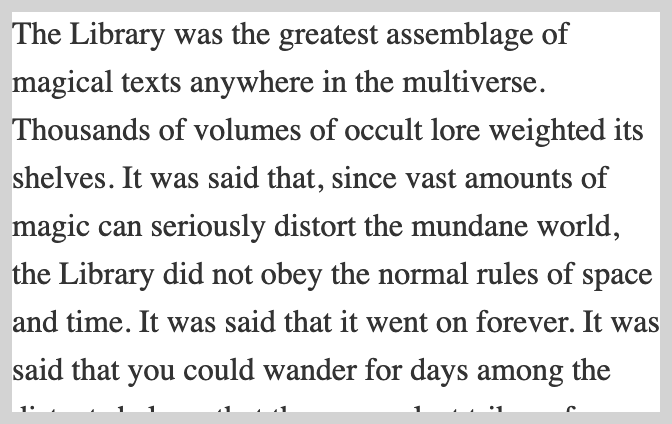
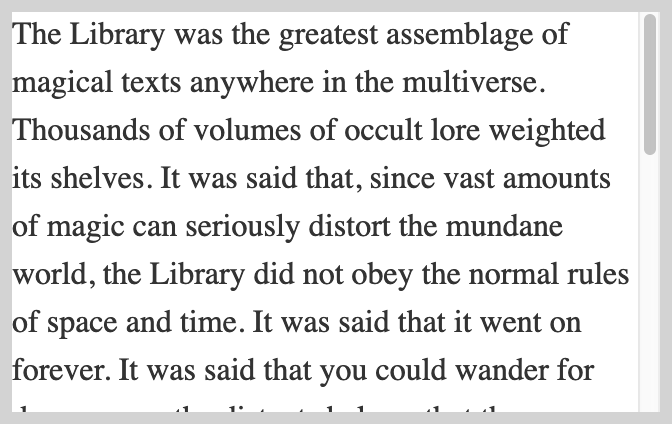
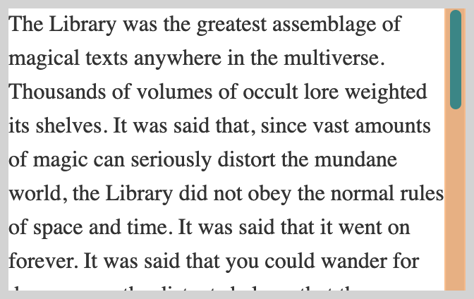

# Explainer: CSS Scrollbars

- Contents:
  - [Author](#author)
  - [Participate](#participate)
  - [Introduction](#introduction)
  - [Background](#background)
  - [Definition and values](#definition-and-values)
  - [Layout](#layout)
  - [Painting](#painting)
  - [References](#references)
  - [Illustrations 🌅](#illustrations-)

## Author

* [Felipe Erias](felipeerias)

## Participate

* [Chromium intent-to-prototype]()
* [TAG design review]()

## Introduction

The [CSS Scrollbars Module Level 1](https://drafts.csswg.org/css-scrollbars/) allows authors to style scrollbars by specifying their color scheme and thickness.

It introduces two properties:

* `scrollbar-color` provides the capability of changing the color scheme of scrollbars so they fit better into the particular style of a web page;
* `scrollbar-width` allows the use of narrower scrollbars that may be more suitable for some use cases, or even to hide the scrollbars completely without affecting scrollability.

## Background

There are three main use cases that the CSS Scrollbars spec intends to resolve:

* Coloring scrollbars to fit better into the UI of a web application.
* Using a thinner scrollbar when the scrolling area is small.
* Building custom scrollbars without affecting scrollability.

See here for more detail: https://www.w3.org/wiki/Css-scrollbars#Use-cases

## Definition and values

### `scrollbar-color`

The syntax for the `scrollbar-color` property is:

```
auto | dark | light | <color>{2}
```

These values have the following meaning:

* `auto`: the scrollbar is rendered following the platform default. Initial value.
* `dark`: display a dark scrollbar, either a dark variant provided by the platform or a custom one with dark colors.
* `light`: display a light scrollbar, either a light variant provided by the platform or a custom one with light colors.
* `<color>{2}`: the first color is applied to the thumb (the moving part) and the second is applied to the track (the static part) of the scrollbar.

### `scrollbar-width`

The syntax for the `scrollbar-width` property is:

```
auto | thin | none
```

These values have the following meaning:

* `auto`: default scrollbar width in the platform. Initial value.
* `thin`: display a thinner scrollbar than `auto`, either a thin variant provided by the platform or a custom one thinner than the default.
  * Implementations may treat this value as `auto` on platforms that already use a tiny scrollbar as the default.
  * Use case: display a thinner scrollbar when the scrolling area is small.
* `none`: no scrollbar is displayed.
  * The element’s scrollability is not affected.
  * Use case: allow the building of customized scrollbars without affecting scrollability.

## Layout

The property `scrollbar-width` influences the layout in as much as it modifies the amount of space taken up by the scrollbar. This in turn has consequences for properties such as `scrollbar-gutter` which take the scrollbar's thickness as reference.

Other than that, the layout of scrollbars and related/adjacent content, and whether content is scrollable, is out of the scope of this spec. Those features are specified in the CSS Overflow module.

## Painting

If `scrollbar-color` computes to a value that is not `auto`, implementations may display a simpler scrollbar than the platform default.

This spec does not define the exact position or shape of the scrollbar, or any animation that may be applied to it.

## References

* Spec:
  * [CSS Scrollbars Module Level 1](https://drafts.csswg.org/css-scrollbars/)
* Relevant CSSWG discussions and information:
  * [#1955 standardization of scrollbar color properties](https://github.com/w3c/csswg-drafts/issues/1955)
  * [#1958 Should we also add scrollbar width control](https://github.com/w3c/csswg-drafts/issues/1958)
  * [CSS Scrollbars use cases](https://www.w3.org/wiki/Css-scrollbars#Use-cases)

## Illustrations 🌅

```
scrollbar-width: none;
```



```
scrollbar-width: thin;
```



```
scrollbar-width: auto;
```


```
scrollbar-width: thin;
scrollbar-color: #378687 #e8b080;
```


```
scrollbar-width: auto;
scrollbar-color: #378687 #e8b080;
```



(Made using Firefox on OS X with classic scrollbars — note that Firefox does not support the `light` and `dark` values of `scrollbar-color`)
